# 漫画動画動画パイプライン v46

## 正式な入口

新規エピソードは次だけを使う。

```bash
npm run manga-video -- full --script-path /absolute/script.txt --episode-id manga-<id> --protagonist-speaker-id <id-or-exact-name>
```

`npm run manga-video:legacy` と `apply/finalize/generate-manga-v*` は `manga-photo-homecoming-001` の過去移行専用で、新規制作には使わない。

## 処理の流れ

```mermaid
flowchart LR
  A["台本・読み・時系列"] --> B["主人公確定・人物バイブルと承認候補"]
  B -->|承認待ちなら停止| C["全画像ジョブ・構図QA"]
  C --> D["現画像の顔検出と吹き出し配置"]
  D --> E["cut単位 Eleven v3 複数テイク"]
  E --> F["時刻再計算・吹き出し再配置"]
  F --> G["1920×1080 / 30fps MP4候補"]
  G --> H["実MP4統合監査"]
  H --> I["Claude/Codex コンタクトシート実見"]
  I --> J["最終監査再実行・final-koya-audited"]
```



生成上限では `waiting-usage-limit`、新キャラでは `awaiting-character-approval`、元画像の顔検出に失敗した場合は `awaiting-source-face-review` で止まる。どれも完成ではない。状態はエピソードの `koya-production-state.json` に保存され、入力ハッシュが一致する完成済み素材を再生成しない。

## 一つの契約、一つのスキル

- 実行設定: `config/koya-manga-production-contract.json`
- エピソード例外: `config/koya-manga-episode-overrides/<episode-id>.json`
- 要求履歴: `docs/koya-channel-requirements-ledger.md`
- 共通スキル正本: `.agents/skills/manga-video-production` と `.agents/skills/manga-page-camera`
- Claudeアダプター: `.claude/skills/...`
- Codexアダプター: `.codex/skills/...`

ClaudeとCodexは同じ正本を読む。ホスト別コピーへ制作規則を重複記載しない。

新規作品では、四角いナレーション枠は表示上の`narration`として維持する一方、音声は`--protagonist-speaker-id`で確定した主人公の承認済みVoice IDへ強制的に一致させる。専用ナレーターは作らない。複数人物の作品で主人公が未指定・曖昧なら、有料生成前に停止する。旧完成作品の凍結済みナレーターだけはepisode overrideとして履歴保持する。

## コマンド

```bash
# 契約確認（無課金・read-only）
node scripts/koya-manga-video.mjs contract

# 計画だけ
node scripts/koya-manga-video.mjs plan --script-path /absolute/script.txt --episode-id manga-<id> --protagonist-speaker-id <id-or-exact-name>

# 分割実行・再開
node scripts/koya-manga-video.mjs images --script-path /absolute/script.txt --episode-id manga-<id> --protagonist-speaker-id <id-or-exact-name>
node scripts/koya-manga-video.mjs prepare --episode-id manga-<id>
node scripts/koya-manga-video.mjs speech --episode-id manga-<id>
node scripts/koya-manga-video.mjs render --episode-id manga-<id>
node scripts/koya-manga-video.mjs audit --episode-id manga-<id>

# 実際にコンタクトシートを見た後だけ
node scripts/koya-manga-video.mjs signoff --episode-id manga-<id> --reviewer codex --pass
node scripts/koya-manga-video.mjs audit --episode-id manga-<id>
```

## 完成ゲート

最終MP4は、契約・quality harness・光学フローカメラ・吹き出し中間フレーム・完全無表示切替フレーム・カメラ掃引・独立顔検出・縦組ラスタ・心の声・分割ページ・STT・冒頭・波形同期・音量差・クリック・ハム・全編デコード・エージェント目視証跡が全て合格した場合だけ `outputs.finalVideo` へ昇格する。

`knownRemainingIssues` が1件でも残る場合や signoff の動画SHA-256が変わった場合は、最終状態へ進まない。
