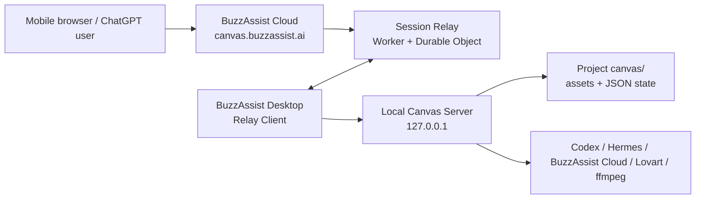

# BuzzAssist Remote Canvas Relay Architecture

## Decision

BuzzAssist should use a **BuzzAssist Cloud Relay** as the final remote-canvas architecture. Do not create one ngrok or Cloudflare Tunnel route per user/session as the product architecture. Keep ngrok/Cloudflare Tunnel as developer and emergency fallback paths only.

The production URL should be owned by BuzzAssist:

```text
https://canvas.buzzassist.ai/s/{sessionSlug}
```

The user's Mac remains the execution environment for local canvas state, Codex/Claude plugin calls, local media files, ffmpeg, Hermes, and desktop-only generation routes. BuzzAssist Cloud only brokers authenticated browser sessions, WebSocket messages, job control, and optional short-lived asset caching.

## Why Not Per-User Tunnels

Cloudflare Tunnel is useful for exposing a local service without opening inbound ports, but it is not the right final abstraction for every BuzzAssist user/session. Cloudflare's published account limits include 1,000 `cloudflared` tunnels per account and 1,000 routes per account, and Quick Tunnels do not support Server-Sent Events. BuzzAssist also needs session permissions, revocation, credit protection, audit logs, and mobile UI behavior that should be controlled by BuzzAssist, not by ad hoc tunnel URLs.

References:

- [Cloudflare One account limits](https://developers.cloudflare.com/cloudflare-one/account-limits/)
- [Cloudflare Quick Tunnels limitations](https://developers.cloudflare.com/cloudflare-one/networks/connectors/cloudflare-tunnel/do-more-with-tunnels/trycloudflare/)
- [Cloudflare Tunnel overview](https://developers.cloudflare.com/cloudflare-one/networks/connectors/cloudflare-tunnel/)
- [Cloudflare WebSockets](https://developers.cloudflare.com/network/websockets/)
- [Cloudflare Access self-hosted applications](https://developers.cloudflare.com/cloudflare-one/access-controls/applications/http-apps/self-hosted-public-app/)

## Current Local Boundary

The current plugin is correctly local-first:

- Canvas state is project-local: `canvas/excalidraw-canvas.json`, `canvas/excalidraw-selection.json`, `canvas/excalidraw-view-state.json`, and `canvas/assets/`.
- The local web server defaults to `127.0.0.1` and writes `canvas/.server.json`.
- The browser backend serves `GET/PUT /api/canvas`, `GET/PUT /api/selection`, `GET/PUT /api/view-state`, `POST /api/generate/image`, `POST /api/generate/video`, subtitle, silence-cut, chat bridge, and asset routes.
- `/mcp` is token-protected and should remain local-only for the final remote browser design.
- Existing local Origin checks are designed for local browser access, not arbitrary public web access.

Final remote access should not punch the whole local API surface through a public tunnel. It should expose a narrower relay protocol.

## Final System



### Components

`BuzzAssist Desktop Relay Client`

- Starts with the canvas server or the BuzzAssist app.
- Maintains one outbound WebSocket to BuzzAssist Cloud per active remote session.
- Never requires inbound ports.
- Executes relay requests against `127.0.0.1` local APIs or shared library functions.
- Streams scene snapshots, updates, progress events, and asset bytes/metadata back to Cloud.

`BuzzAssist Cloud Relay`

- Owns `canvas.buzzassist.ai`.
- Authenticates the BuzzAssist user and session viewers.
- Creates remote sessions and short high-entropy slugs.
- Uses a per-session coordinator, ideally a Cloudflare Durable Object or equivalent stateful session service.
- Routes messages between mobile browsers and the connected desktop.
- Stores only bounded metadata and optional short-lived cached assets.

`Mobile Remote Canvas UI`

- Serves a mobile-friendly canvas shell from BuzzAssist Cloud.
- Displays the current scene and assets.
- Allows direct image/video/SRT/silence-cut generation when the session permission allows it.
- Shows QR/share link, online/offline state, generation progress, and credit estimate.

`Codex / Claude Code Session Path`

- Remains unchanged. A user can instruct the already-open Codex/Claude session from mobile ChatGPT.
- Codex/Claude calls the local plugin.
- The local canvas changes are observed by the Desktop Relay Client and pushed to the remote browser.

## Session Model

Remote sessions are separate from local projects. A project may have zero or more active sessions.

```ts
type RemoteCanvasSession = {
  id: string;
  slug: string;
  ownerUserId: string;
  projectFingerprint: string;
  canvasDirHash: string;
  mode: "view" | "control" | "generate";
  status: "waiting_for_desktop" | "online" | "offline" | "revoked" | "expired";
  expiresAt: string;
  createdAt: string;
  lastSeenAt: string;
};
```

Permissions:

- `view`: scene and assets only.
- `control`: view plus selection, viewport, layout, and non-billing canvas edits.
- `generate`: control plus image/video/SRT/silence-cut generation and credit-consuming actions.

Default should be `view`. The owner can explicitly upgrade to `generate`.

## Public API Shape

Cloud routes:

```text
POST /api/remote-canvas/sessions
GET  /api/remote-canvas/sessions/{id}
POST /api/remote-canvas/sessions/{id}/revoke
GET  /s/{sessionSlug}
GET  /api/remote-canvas/sessions/{id}/bootstrap
GET  /api/remote-canvas/ws?sessionId=...&role=desktop|viewer
GET  /api/remote-canvas/assets/{sessionId}/{assetId}
POST /api/remote-canvas/uploads
```

Local-only routes stay local:

```text
/mcp
/api/canvas
/api/generate/*
/api/chat/send
```

The remote browser never calls those local routes directly. It sends relay messages to Cloud; the Desktop Relay Client performs the local operation.

## Relay Protocol

All messages are envelopes with a session id, request id, type, actor, and idempotency key.

```ts
type RelayEnvelope<T = unknown> = {
  v: 1;
  sessionId: string;
  requestId: string;
  actor: "desktop" | "viewer" | "cloud";
  type: string;
  idempotencyKey?: string;
  payload: T;
};
```

Core message types:

```text
desktop.hello
desktop.heartbeat
scene.snapshot
scene.patch
asset.manifest
asset.fetch
asset.chunk
job.create
job.progress
job.result
job.error
session.permissionChanged
session.revoked
```

Scene updates should be server-authoritative from the desktop side. The mobile UI can request changes, but the desktop confirms them by applying the local operation and emitting the resulting scene update.

## Direct Mobile Generation Flow

1. Mobile browser opens `https://canvas.buzzassist.ai/s/{slug}`.
2. Cloud verifies the viewer and session permission.
3. Mobile submits a generation request, for example image prompt/model/aspect ratio/reference assets.
4. Cloud validates entitlement, rate limits, session permission, and payload shape.
5. Cloud sends `job.create` to the Desktop Relay Client.
6. Desktop runs the same local generation backend used by the current UI/plugin.
7. Desktop writes the result to `canvas/assets/` and updates `excalidraw-canvas.json`.
8. Desktop streams `job.progress`, `job.result`, `scene.patch`, and `asset.manifest`.
9. Mobile UI refreshes in place.

This supports both:

- AI-agent path: mobile ChatGPT -> open Codex session -> local plugin -> relay updates.
- Direct UI path: mobile browser -> BuzzAssist Cloud UI -> relay job -> local execution.

## Asset Strategy

Generated assets remain local by default. Cloud should not become the canonical file store for private project media.

Remote viewing needs asset delivery:

- Small images/thumbnails: optional short-lived R2 cache keyed by session asset id.
- Large videos/audio/SRT/XML: stream through the desktop relay with range/chunk support, optionally cache poster frames and generated files with TTL.
- Mobile-uploaded references: upload to short-lived Cloud storage, then desktop pulls them for the job.
- Never expose absolute local paths to the remote browser.

Asset metadata example:

```ts
type RemoteAsset = {
  id: string;
  kind: "image" | "video" | "audio" | "srt" | "xml" | "script";
  name: string;
  mimeType: string;
  sizeBytes?: number;
  width?: number;
  height?: number;
  durationSeconds?: number;
  remoteUrl: string;
  expiresAt: string;
};
```

## Security Rules

Hard requirements:

- Local canvas server remains bound to `127.0.0.1` for normal operation.
- `/mcp` is not exposed through the remote browser path.
- All remote sessions require BuzzAssist auth or an owner-created signed share token.
- `generate` permission is opt-in and visible in the UI.
- Credit-consuming actions require owner identity, current entitlement, rate limits, and idempotency.
- Session slugs are high entropy and revocable.
- Desktop relay only executes allowlisted operations.
- File access is limited to the active project `canvas/` and explicit uploaded job inputs.
- All generation jobs have audit records: user, session, model, estimated credits, result, error/refund state.
- The remote browser should never receive desktop auth tokens, BuzzAssist media tokens, Lovart credentials, local MCP bearer tokens, or raw local filesystem paths.

## Cloudflare Role

Use Cloudflare for the product edge, not one tunnel per user:

- Cloudflare DNS for `canvas.buzzassist.ai`.
- Cloudflare Workers or the existing BuzzAssist backend for HTTP routes.
- Durable Objects, a stateful Node service, or equivalent for per-session WebSocket coordination.
- R2 for optional short-lived asset staging/caching.
- Cloudflare Access can protect internal/admin preview routes, but normal customer sessions should use BuzzAssist auth and session tokens so the UX stays product-native.

Cloudflare Tunnel remains a fallback:

- Developer preview.
- Personal emergency remote access.
- Debugging a single user's machine with explicit consent.

## Failure Behavior

- If the desktop is offline, the mobile session opens in read-only offline mode and shows the last cloud-cached scene metadata if available.
- If a generation job is submitted while offline, Cloud rejects it unless a future queue mode is explicitly enabled.
- If desktop disconnects during generation, the job becomes `unknown` until reconnect; desktop reconciles job state by reading local canvas/assets.
- Every relay request uses idempotency keys so refreshes and reconnects do not double-charge or duplicate assets.

## Implementation Plan

### Phase 1: Read-Only Remote View

Implemented MVP:

- `buzzassist-canvas --remote-canvas` can create or attach a BuzzAssist Cloud remote session.
- The Mac keeps the local canvas private and publishes scene snapshots through an outbound relay client.
- The mobile route `/s/{sessionId}?t={viewerToken}` shows a read-only canvas preview plus connection status.

- Add `remote-canvas` session creation in BuzzAssist Cloud.
- Add a Desktop Relay Client that connects outbound and sends `scene.snapshot`, `scene.patch`, and `asset.manifest`.
- Add remote mobile viewer at `/s/{slug}`.
- Add QR/public URL display in the local canvas UI.
- Keep remote write/generate disabled.

Validation:

- Open the URL on a phone network outside local Wi-Fi.
- Generate from local Codex/Claude plugin and verify the mobile URL updates.
- Verify `/mcp` and local write APIs are unreachable from the public URL.

### Phase 2: Direct Mobile Generate

Implemented MVP:

- The mobile page can enqueue image and video jobs directly.
- Required settings are explicit UI fields: model, execution target, aspect ratio, quality for images, and model, execution target, aspect ratio, duration, resolution for videos.
- Default batch count is 10 with `columns: 5` and `concurrency: 10`; the existing local batch API chunks longer requests into 10 then the remainder.

- Add `generate` permission.
- Relay `job.create` for image and video first.
- Reuse existing local generation code paths.
- Add credit estimate and confirmation in the mobile UI.
- Add audit/idempotency/refund handling.

Validation:

- From mobile browser, generate an image and video without an AI agent.
- Confirm local `canvas/assets/` and remote mobile view show the same result.
- Confirm unauthorized sessions cannot generate.

### Phase 3: SRT, Silence-Cut, Attachments

Implemented MVP:

- The mobile page requests a direct Convex upload URL for attachments.
- The Mac relay downloads the uploaded attachment, streams it into the local `/api/assets/upload` endpoint, then runs SRT generation or silence-cut against the local path.
- SRT and silence-cut output still lands in `canvas/assets`, keeping the local project as the source of truth.

- Relay SRT and silence-cut jobs.
- Support mobile reference uploads through temporary Cloud storage.
- Support generated XML/SRT downloads through remote asset URLs.

Validation:

- Long video SRT generation from a local file works through remote UI.
- Silence-cut XML downloads from the remote URL.

### Phase 4: Collaboration and Hardening

- Multiple viewers.
- Owner-controlled revoke/extend.
- Session activity logs.
- Asset TTL policy.
- Load testing and reconnect chaos testing.

## Repo Touchpoints

Local plugin repo:

- `scripts/serve-canvas.mjs`: keep local by default; optionally start relay client.
- `vite.config.js`: do not loosen public CORS for final relay mode; local APIs remain local.
- `lib/canvasServerRuntime.mjs`: keep `/mcp` bearer and local-origin assumptions.
- New `lib/remoteCanvasRelayClient.mjs`: outbound WebSocket client and local operation dispatcher.
- `src/App.jsx`: QR/public session panel, permission indicator, remote online state.
- `mcp/server.mjs`: optional tool to create/show/revoke a remote canvas session.

BuzzAssist Cloud repo:

- Session API routes.
- WebSocket/session coordinator.
- Mobile remote canvas shell.
- Auth, entitlement, billing audit, and optional R2 asset staging.

## Deployment Gate

Do not deploy the Vercel app alone for Remote Canvas. The Next routes call
Convex functions under `remoteCanvas`, so the Convex schema/functions must be
deployed first.

Required before deploy:

```bash
npm run check:remote-canvas-env
npx convex deploy --yes
npm run build
vercel deploy
```

The current gate requires either `CONVEX_DEPLOY_KEY` or `CONVEX_DEPLOYMENT`.
`CONVEX_URL` plus `CONVEX_ADMIN_KEY` is enough for the Next API at runtime, but
not enough to publish new Convex functions.

## Acceptance Criteria

The final design is implemented when all of these are true:

- A BuzzAssist user can create a remote canvas URL for a local project.
- The URL works from a mobile network without VPN or local Wi-Fi.
- Local Codex/Claude/plugin generation updates the remote view.
- Mobile browser direct image/video generation works without an AI agent.
- `/mcp` and raw local APIs are not publicly exposed.
- Session permissions and revocation work.
- Credit-consuming jobs are authenticated, idempotent, audited, and rate-limited.
- Remote browser never sees local filesystem paths or provider secrets.
- Generated assets are accessible remotely through signed/TTL URLs.
- Offline/reconnect behavior is deterministic and tested.
